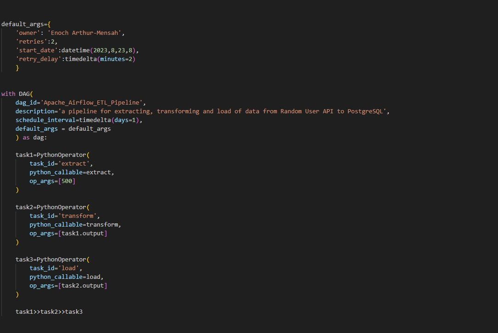

# Apache Airflow ETL Pipeline: Random User API to PostgreSQL

## Project Description

This project centers around designing and executing  an ETL pipeline using Apache Airflow  for workflow orchestration. Extract from a Random User API, then apply essential transformations like cleaning and filtering for seamless data integration or loading into a database. Automation shines as you adeptly schedule DAG intervals, showcasing Airflow's strength. Workflow oversight is streamlined via the Airflow user interface, backed by strong error handling and logging.

## Prerequisites

- Docker
- Docker Compose
- PostgreSQL 
- Python

## How to Install and Run the Project

The project will run in Docker container. Therefore, Docker and Docker Compose must be installed on your workstation.
- Install Docker on your workstation.
- Install Docker Compose on your workstation.

If Docker and Docker Compose are installed follow the steps below:

- Clone the repo: git clone https://github.com/EnochArthurMensah/Apache-Airflow-ETL-Pipeline-Random-User-API-to-PostgreSQL.git
- Once cloned, go to the project directory
- Launch docker and ensure it running
- Open terminal or gitbash and enter  docker-compose up -d
- It may take few minutes for the containers to download and install the required dependencies. Once the container is up, open browser and go to localhost:8080 to open apache airflow User: airflow and Password: airflow
- To run it once, trigger the Apache_Airflow_ETL_Pipeline by clicking the play button under the Actions column or trigger DAG
- You can watch the log files 

## Documentation

The need libraries were imported at the start of the project. In this project catch and handle exceptions were used in all the functions. 

Created an extract() function with a limit keyword, governing dataset extraction. A strategic while-loop fetches API data iteratively until the desired state is achieved. Deliberate one-second delays intersperse loops, preventing website access issues. Ingeniously, a browser-identifying header augments access strategy. The limit keyword specifies the number of user records to be extracted.

Dive into data transformations, employed a for loop to extract essential user data, seamlessly stored in a dictionary. This resource fueled a streamlined dataframe, accelerating transformations like converting "date_of_birth" column data type from object to datetime64. Removed duplicate  through email-based subset.The dataframe was return in a  JSON format for the transform() function.

PostgreSQL connection was established with the help of  Engine creation facilitating robust linking. The loading spectacle ensued, as JSON-formatted dataframe gracefully journeyed through pd.to_sql(), orchestrated by the all-encompassing engine. All these happened in the load() function.

A DAG was created with a daily schedule interval at 8:00am. Python operators took the stage, delineated by DAG IDs—'Extract,' 'Transform,' and 'Load.' Task names—'1,' '2,' and '3'—narrated their distinct roles.
Dependencies were deftly mapped as :
 task1>>task2>>task3

 
## setup instructions

- Open pgAdmin and create a server called airflow
- enter the credentials as seen in the image below

- create a database called "users"

## Contributing

Contributions are always welcome!

See `contributing.md` for ways to get started.

Please adhere to this project's `code of conduct`.

## License

[MIT](https://choosealicense.com/licenses/mit/)

